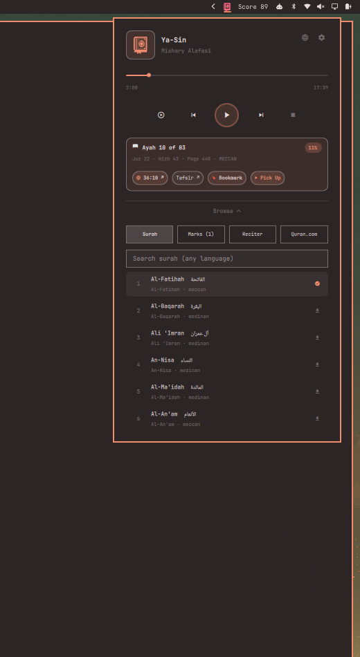

# Quran Plugin for Omarchy

<p align="center">
  
</p>

An elegant, feature-rich Quran recitation player and reader companion for the Omarchy Linux desktop environment. Listen to recitations from world-renowned Qaris, track your reading position across Surahs, Ayahs, Juzs, and Pages, bookmark your progress with instant one-click **Pick Up**, and explore rich Quranic resources with Quran.com integration.

---

## Highlights & New Features

* **Spacious & Modern UI**: Roomy 440px layout designed to integrate seamlessly with Omarchy's system theme and typography.
* **Monochrome Closed Mushaf Icon**: Uniform, clean icon matching the system bar theme.
* **Reader Location Tracker ("Where The Reader Is")**: Live indicator computing current Surah, estimated Ayah, Juz, Hizb, Page number in the Madinah Mushaf, and progress percentage.
* **Reading Bookmarks & Instant "Pick Up"**: Save bookmarks with timestamp and ayah position, and pick up right where you left off anytime with a single click.
* **Quran.com Explore Suite**: Direct one-click access to the current Ayah on Quran.com, Ibn Kathir/Sa'di Tafsir, word-by-word morphology/grammar, Madinah Mushaf layout, and the personalized reading experience guide.
* **Model Context Protocol (MCP) Server**: Built-in Python MCP server (`mcp/server.py`) exposing reader position, verse lookups, player controls, and bookmark management to AI coding assistants (Claude, Antigravity, etc.).
* **Instant Streaming & Offline Audio**: Fast byte-range streaming via a hardened loopback Go audio proxy (`quranproxyd`) with deep media validation and background full-mushaf caching.
* **Multilingual Search**: Live instant search across 114 Surahs and reciters in Arabic, English, and 9 additional languages.

## Dependencies

* `mpv` (runtime; the player).
* `mpv-mpris` (recommended for system media control).
* `file` (runtime, used by the media validator; falls back gracefully if
  missing).
* `ffprobe` (optional; deep validation when present).
* Go 1.22+ — **only** if you use `install.sh --build` instead of downloading
  prebuilt binaries.

## Install

```sh
omarchy plugin add https://github.com/saifomar/mus.quran.git --enable
```

Then install the audio engine (downloads attested prebuilt binaries from
GitHub Releases):

```sh
./install.sh
```

**Optional**: compile locally instead of downloading:

```sh
./install.sh --build
```

Then restart your Omarchy shell.

## Uninstall

To completely remove the mus.quran engine and its local data:

```sh
./uninstall.sh
```

If you installed the engine with a custom prefix, pass the same prefix when
uninstalling:

```sh
./uninstall.sh --prefix "$HOME/.local/share/bin"
```

The uninstall script removes the installed `quranproxyd` and `quranctl`
binaries along with mus.quran's downloaded audio, cache, and settings.

No `sudo` is required.

After uninstalling, restart your Omarchy shell or disable/remove the plugin
to unload the running engine.

## Build from source

```sh
make build          # dev build into ./bin (unstripped)
make install        # installs ./bin binaries into ~/.local/bin
make prebuilt       # static, stripped binaries for amd64 + arm64
make dist           # tar.gz + SHA-256 archives per arch (for releases)
make test           # Go unit tests
```

The Go module has **zero external dependencies** (`go.mod` has no `require`
block), so builds work offline.

Prebuilt binaries are built and attested via GitHub Actions on each push to
`main` and on version tags. See [`.github/workflows/release.yml`](.github/workflows/release.yml).

## Security

This plugin was written with the security model of the Omarchy shell in mind
(plugins run as unsandboxed code, so they are only as safe as their code):

* The proxy binds **127.0.0.1 only**, and every request requires a per-run
  32-hex token shared via a 0600 handoff file in a 0700 runtime dir.
* Origin URLs are built **only** from the validated reciter catalog and
  validated through a strict allowlist — no arbitrary URLs, no redirects
  followed, DNS is pinned to the allowlisted host.
* The daemon **never writes `quran.json`**; it reads the catalog and signals
  progress over stdout events. There is exactly one writer for your state file.
* Media is validated (size cap, MIME, ffprobe) before a file is accepted as a
  permanent download; downloads stage through unique temp files and atomic
  renames.
* No sudo, no install hooks, no writes outside your own state/cache/runtime
  dirs.

## Usage

* Left-click the bar icon to open the popup and select a surah to play.
* Right/middle-click toggles play/pause; scroll wheel moves prev/next surah.

### IPC

The service registers as the `quran` IPC target:

```sh
omarchy-shell quran status
omarchy-shell quran playSurah <reciter> <surah>
omarchy-shell quran download <reciter> [surah]
omarchy-shell quran cacheInfo
omarchy-shell quran clearCache
```

## Special Thanks

Special thanks to **AksharP5/omarchy-radio-atlas** for showing how to approach
Omarchy plugin integration and serving as a useful reference while building
mus.quran.

## License

MIT — see [LICENSE](LICENSE).

---

*This repo used to be a self-contained shell plugin; it is now a single
repository hosting both the plugin and its Go audio engine. See
[docs/PLAN.md](docs/PLAN.md) for the design history.*
